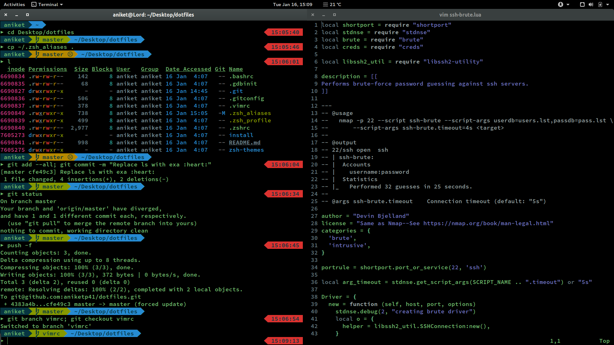

# Shell-Configs
Collection of all the configuration files made to ease and speed up the significant part of my life spent on shell. Well, these serve as a means of procrastination too.

```
           ______       ____  _____          ____        
          / __/ /  ___ / / / / ___/__  ___  / _(_)__ ____
         _\ \/ _ \/ -_) / / / /__/ _ \/ _ \/ _/ / _ `(__,
        /___/_//_/\__/_/_/  \___/\___/_//_/_//_/\_, /___/
                                               /___/ 
```


---

<!--On any normal day - <br>-->
<!---->

## Requirements
* vim
* zsh
* [oh-my-zsh](http://ohmyz.sh/)
* [Powerline fonts](https://github.com/powerline/fonts#powerline-fonts)

## Installation
The installation script is brief.
``` shell
 cd dotfiles/scripts
 ./install
```

## Other Scripts
The [install]() script moves the originally existing dotfiles to the respective `.backup`. In case nothing broke after installation, it is recommended to remove the corresponding backup files. To do that, just run `scripts/remove_backup`.

`scripts/bsdsetup` is a quick setup for FreeBSD VMs. I have separate BSD machines for specific set of tasks, this script helps in quick environment setup.

## Acknowledgement
The original construct along with a part of powerlevel9k zsh-theme and install script was borrowed from [**Shivansh Rai**](https://github.com/shivansh)'s [dotfiles](https://github.com/shivansh/dotfiles).
